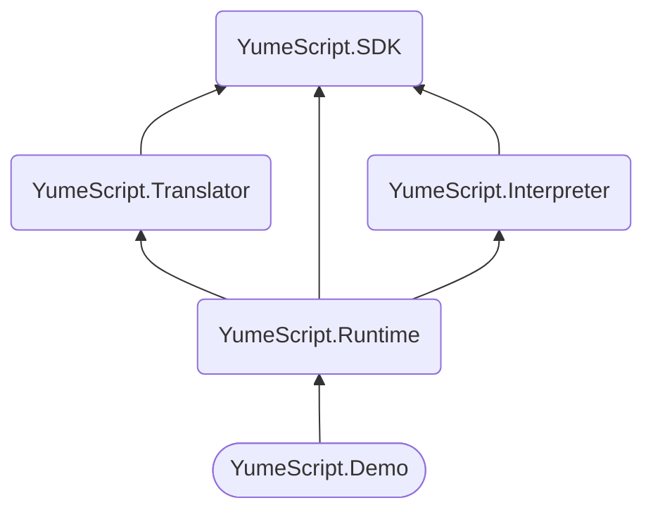

# ****YumeScript****

**YumeScript** is a programming language built on .NET inspired by Ren’Py with the focus of writing narrative game scripts. The main feature of YumeScript is its modularity - the language can be easily updated with new instructions; execution implementation can be changed at the runtime.

**Godot integration can be found here (ToDo).**

## Code Example

```python
# Define chapter (function)
yuu_presentation:

	# Execute code in GDScript
	$ sys.log("debug!")
	# Multiple lines as well
	$:
		env.scene("example")
		env.music("example")

	# Narrative phrases 
  * "After waiting for what felt like half an hour, a girl entered the room."

	# Character phrases with "prefix" or "unnamed" arguments
	me normal "..."
	yuu normal "Hi! Yuu is here"

	# Repeating last phrase format
	- "This should be... where the interview is taking place, right?"

  # "Postfix" or "named" arguments
	me normal "..." text_speed=0.3
	yuu sad "I'm extremely sorry for being so late.."

  # Executing runtime controller
	$ chars.clear()

	# Branching
	?:
		"We'll have a talk about this later. Firstly, tell me about yourself":
			# Call another chapter (function)
			# Upon completion, the control flow will be returned back
			-> yuu_talk
			-> finale
			# Set chapter-specific variables
			$ sys.set(".example", false)
			# Set script-specific variables
			$ sys.set("yuu_fail", false)
			# Set global variables (automatically saved)
			$ sys.set("!game_complete", true)
			# Return from the chapter
			<-

		"Nah, no way this would work for you. Let's end it right here":
      # Multiple arguments
			yuu sad hide "But..."
			
			# Brancing with time limitation
			?: time=3.0
				"... Only ONE chance, understand?":
					-> yuu_talk
					-> finale
					$ sys.set("yuu_fail", false)
					$ sys.set("!game_complete", true)
					<-
				# Fallback option in case player has no time to answer
				"":
					me normal "No \"buts\", just go!"

			$ sys.set("yuu_fail", true)
			$ sys.set("!game_complete", true)

			-> finale

yuu_talk:
	
	yuu tricky "I bet Player won't notice this section does not exist"

finale:

	# Conditions
	$if sys.get("yuu_fail"):
		* "Yuu is not suitable for the main character role."
	$else:
		* "Yuu is suitable for the main character role."
```

**Documentation can be found here (ToDo).**

## Architecture Overview



## Get Started with Integration

## How to Build / Requirements

## License

YumeScript is Copyright 2022 Aki Aoki under the MIT License.
